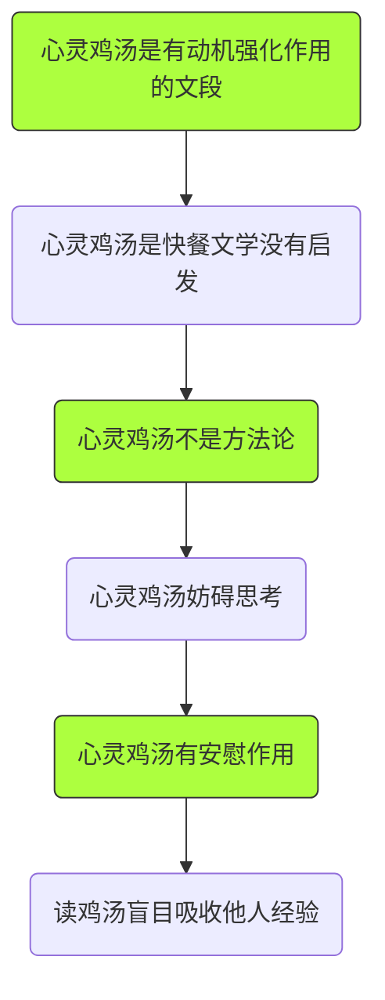

# 报告

> *这场辩论独特且精彩，让我意犹未尽--齐保坤老师*

第11周周四的思修讨论课是一场所有同学参加并且参与讨论的辩论课。同学们分成正反方，讨论前，在己方内交流自己的观点；讨论时，逐次提出自己的论点；讨论后，对辩论恋恋不舍。此次讨论课的辩题是"心灵鸡汤有/没有营养"，正方认为：心灵鸡汤改善心情，调节生活态度，起到了安慰作用；反方认为：心灵鸡汤方法空洞，盲目地哄骗自己，没有实际作用。本次辩论三分钟一轮的形式，激烈，灵活，并且可控，给同学们的辩论提供了有力的支持。  

[toc]

## 辩论内容

经过辩论的两次复盘，简单总结辩论进程如下：

总结：

- 正方认为：心灵鸡汤改善心情，调节生活态度，起到了安慰作用。

- 反方认为：心灵鸡汤方法空洞，盲目地哄骗自己，没有实际作用。

## 辩论形式

+ 辩题选择：在七个辩题中，由同学投票选择一个自己认为可写，可发言的题目。某种意义上说，同学们自己选出来的辩题为这次同学们的积极发言提供了基础。
+ 辩论准备：在辩题确认以后，同学们开始着手写100字的案例/论据，和900字的分析/发言稿。由于这次辩论的辩题是2016年华辩世锦赛的半决赛题目，并且很巧的是，反方就是大连理工大学的辩论队，同学们可以在互联网上找到当年辩论的视频和同学写的辩论复盘，这为同学们展开思路提供了像辩论队老师一样的指引。

+ 辩论进行：辩论开始前，同学们在15分钟内，交流各自思考的角度和攻击对方的思路，然后抽签在每组中产生四位评委，为每一轮的辩论打分；辩论时，由正方开始，每一轮由不同的组员提出自己的案例/论据，紧接着立即展开自由辩论，自由辩论时可以对该轮对方辩手发言发出质疑与反驳，也可以对之前所发出的言论进行反驳；可以引用自己的论据来稳固己方观点，也可以引用己方论据，甚至可以找出对方任何一轮的破绽来作为自己的论据；任何一方都可以在提出论据时改变己方论述的角度，扭转己方的局势。

+ 辩论后期：同学上交100+900字发言分析稿和感悟，班级上交此总结，幻灯片与视频照片等资料。

## 存在的问题

- 论述重复：因为讨论课时间远长于传统辩论赛，所以对一个问题的分析在逐渐透彻以后就变得重复与啰嗦。比如，在讨论中关于“营养”和"心灵鸡汤"的定义多次出现，提到"心灵鸡汤是不是方法论"的讨论进行了5轮之久。
- 己方观点混乱：由于群辩的形式，每组10个人的定义，论据，论述思路，不能很好的统一。比如，反方对"心灵鸡汤"的定义进行了三次改动，这就给正方留下了很好的辩论空间。
- 论据不坚固：辩手在搜集论据以后没有进行仔细的思考就加以运用，并且队友也没有发现指出。比如，反方使用论据"拜金女因为读心灵鸡汤而拜金"显然不构成很可靠的因果关系。